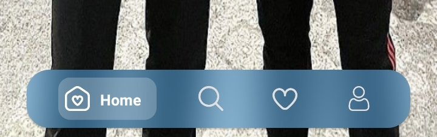

# 🎨 Navigation Bar Style
> Transform your Android app's navigation into a stunning, modern masterpiece with blur effects! ✨

[](https://techforpalestine.org/learn-more)

<p align="center">
  
</p>

[](https://developer.android.com/index.html)
[](https://android-arsenal.com/api?level=21)
[](https://opensource.org/licenses/MIT)

## 🌟 What's This?

Navigation Bar Style is a stunning Android project that showcases how to create a modern, iOS-inspired navigation bar with beautiful blur effects and smooth animations. Perfect for developers looking to add that extra touch of elegance to their apps!

## ✨ Features That Make It Special

### 🎯 Gorgeous Blur Effects
- Stunning iOS-style blur in the navigation bar
- Beautiful transparency effects that adapt to your content
- Smooth, animated transitions between states
- Perfect balance between beauty and performance

### 🎨 Modern Design Elements
- Clean, minimalist interface
- Smooth icon animations
- Professional-grade transitions
- Eye-catching visual feedback

### ⚡ Smooth Performance
- Butter-smooth 60 FPS animations
- Optimized blur effects
- Responsive touch handling
- Memory-efficient implementation

## 🎯 Perfect For Learning

- 📱 Modern Android UI techniques
- 🎨 Implementation of blur effects
- ✨ Advanced animations
- 🎯 Clean code architecture
- 💡 Best practices in Android development

## 🚀 How to Use

1. Clone this repository
2. Open in Android Studio
3. Run on your device or emulator
4. Explore and customize!

## 📱 Demo Showcase

### Main Features:
- 🎨 Beautiful blur navigation bar
- ✨ Smooth page transitions
- 🎯 Responsive touch feedback
- 💫 Professional animations
- 🎭 Dynamic text visibility
- 🌈 Customizable colors

## 💡 Technical Highlights

```java
// Creating that perfect blur effect
public void _blurr(final double _value, final BlurView _view) {
    _view.setupWith(rootView)
        .setBlurRadius(radius)
        .setBlurAutoUpdate(true)
        .setHasFixedTransformationMatrix(true);
}
```

## 🎨 Customization

Want to make it your own? You can easily customize:
- 🎯 Blur intensity
- 🎨 Color schemes
- ✨ Animation durations
- 📏 Layout dimensions
- 🔲 Corner radius
- 🖼️ Icons and text

## 📱 Screenshots

<p align="center">
  
</p>

## 🚀 Why You'll Love It

- 📱 Modern and professional look
- 🎨 Easy to understand code
- ✨ Smooth animations
- 💡 Great learning resource
- 🎯 Production-ready quality

## 🤝 Contribution

Feel free to contribute! Whether it's:
- 🐛 Bug fixes
- ✨ New features
- 📚 Documentation
- 🎨 UI improvements

## 📄 License

This project is MIT licensed. Feel free to use it in your own projects!

## ⭐ Show Your Support

If you find this project helpful or interesting, give it a star! ⭐

---

Made with ☕ and 🎨🖌️

🎨 Bringing iOS-style navigation beauty to Android
